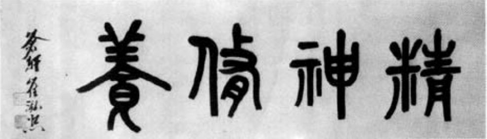

# VOL 1

## PREFACE (Morimal)

Words are inadequate to describe my feeling of jubilation on the day that Taekwon-Do was born, but at the same time, I was assailed by doubts and apprehensions. How many people would actually come to recognize and understand Taekwon-Do during my lifetime? It seems as though this happened only yesterday, and yet many years have passed, and today Taekwon-Do is not only an official activity of CISM (Council of International Sport Military), but it is under consideration for inclusion in the International Olympic Games. All of this has made me realize once again that the days travel with the speed of a flying arrow and the years flow like an irreversible river, but most significantly, it also proves that determination and faith can overcome any obstacle.

All things are governed by the law of Yin and Yang (dark and light). Happiness can often stem from catastrophic moments. My painful experiences of degradation and humiliation, when the Japanese colonization of Korea reduced me to a person without a country, inspired me to learn Taekwon-Do. I was further motivated by my desire to preserve and spread the spirit and wisdom of the Korean people to the world.

Needless to say, Taekwon-Do could not possibly have achieved the status it enjoys today without the tears of silent agony shed by the pioneers of Taekwon-Do who strove against all odds to introduce their art to the world.

Retrospectively, my troubles began soon after the formation of the Republic of Korea Armed Forces. Despite fierce opposition from my colleagues, I succeeded in introducing Taekwon-Do as a compulsory course in the army curriculum.

I was repaid with jealousy, slander and finally oppression. As a result, my army career came to an abrupt end. This was merely a prelude for what was to follow. The civilian gyms practicing Dang Soo-Do (Karate-Do) and Kong Soo-Do (Karate-Do) saw Taekwon-Do as a possible threat.

They reacted with bitter criticism. It is no wonder that these people, in whom a sense of nationalism is totally lacking, still hold a grudge against me. The incredible popularity of Taekwon-Do, in Korea as well as abroad, rapidly drove the practitioners of inferior martial art forms out of business.

My obsession with Taekwon-Do further led me to stand firm against the desire of corrupt government officials who wanted to use Taekwon-Do as a political instrument to strengthen their dictatorship. My outspoken criticism of the South Korean government - both then and now - has been frequently misinterpreted, making me appear as an enemy of my own people.

Taekwon-Do soon secured its international reputation for being both superior and different from the Karate that had previously been dominating the world of martial arts. This rivalism naturally added other names to my ever-increasing list of enemies.

In summation, my life has been a turbulent one, riddled with lonely fights and unfortunate adventure that few would envy ... a life of self-exile thousands of miles distant from my beloved country. Even so, it has truly been a worthwhile endeavor.

My dream has at last been realized... the ultimate fantasy of spreading and teaching Taekwon-Do with no regard to considerations of religion, ideology, national boundaries, or race. I can say without hesitation that I am the happiest man alive.

It is my earnest desire that Taekwon-Do should retain its original concept and technique. It is my sincere hope that Taekwon-Do's emphasis on promoting a healthier body and mind will provide a significant contribution to human progress for many generations to come.

It is one of nature's ironies that delicate plants such as orchids or tulips require extreme care while weeds flourish with no attention at all. Wild panic grass, easily mistaken for wheat or rice, can actually prevent the growth of the genuine article. I cannot help but despair over the tainted image of TaekwonDo recently created by practitioners of sham Taekwon-Do, who have nothing in common with the origin and art form except for a borrowed name.

I console myself with this thought: Like a counterfeit diamond that cannot cut glass, fraudulent Taekwon-Do is appearance without substance and like a summer shower that quickly dries from the earth or a hurricane that rapidly passes from the sky, phoney Taekwon-Do practitioners and imitators cannot endure. It exists solely on the strength of political influence and is totally devoid of fundamental philosophy or technique based on logic. As such, it is destined for an early exist. The issue lies in our ability to differentiate between the true and the false.

I wish to dedicate this Encyclopedia, ... the last product of my life-long research ... to my students in the hope that it will assist them in their pursuit of true Taekwon-Do.

I give special thanks to all instructors and black belt holders of many countries who have posed for photographs within this edition.

My sincere appreciation also goes to Mr. Han Chang Sam and my beloved student Sabree Salleh who willingly gave up much of their valuable time for photographing required for this edition.

Image: The author and the author's son Choi Joong Hwa and Master Park Jung Taek with his wife Glenda Park conduct a last minute review in the preparation of this encyclopedia

## TAEKWON-DO AND IMITATORS

Today, the enormous popularity of Taekwon-Do has created imitators, and whilst at times imitation is the sincerest form of flattery, in the case of Taekwon-Do, this is definitely not true. To imitate without full knowledge of the original is dangerous. It is somewhat akin to allowing a child to play with a toy gun, then giving him a real gun and expecting the child to understand the difference without giving him the knowledge of the function and effect of a real gun.

In most instances of imitation, the imitator simply mimics the original without any change. Usually, this does not cause any harm provided the one who imitates does not change the original (in this case Taekwon-Do) by unproven additional techniques, interpretations. philosophy, terminology or systems and methods.

It is when unauthorized changes to the original art of Taekwon-Do take place that these imitators create a highly dangerous and eroding influence upon the concept of Taekwon-Do.

Dangerous, because it gives to the students of the imitators a sense of mastery of techniques which are completely unfounded in the knowledge of the true martial art of Taekwon-Do.

Dangerous, because a student may become a teacher and all unknowingly imparts his false techniques to others, thus compounding the error of false knowledge. This will lead to an erosion of confidence, by serious students, in Taekwon-Do as a proven martial art.

Confusion has recently arisen by the use of the terminology "TAEKWON-DO, THE KOREAN ART OF SELF-DEFENSE," I emphasize the word Korean.

Today, in the South Korea, it is becoming the practice to indiscriminately apply the word Taekwon-Do to a bastardized imitation of the real original Korean martial art.

General Choi Hong Hi has been creating, developing the art of Taekwon-Do since early 1946, in what is now known as the Republic of Korea. It is true that General Choi was born in Korea and at the time of developing and introducing Taekwon-Do he resided there. It is also true that the basis of Taekwon-Do goes back to the ancient past of Korea, but to call Taekwon-Do purely Korean is somewhat like one country claiming to have introduced fire.

The true Taekwon-Do of General Choi knows no boundaries of countries; it is a universal art of self-defense. It is also an art for which the author of this encyclopedia has devoted his life, not only to retain the purity of the original Taekwon-Do introduced by him in 1955, but to constantly search for ways of improving the original techniques. Only after exhaustive research and proof of improvement and effectiveness is a change to the original approved and incorporated within the overall art of Taekwon-Do.

These volumes are proof of General Choi's tenacity of dedication to keeping the original Taekwon-Do free from unproved imitations, and with the co-operation of all true Taekwon-Do students, no matter what grade, weed out those who seek to destroy his teachings.

.png>)

